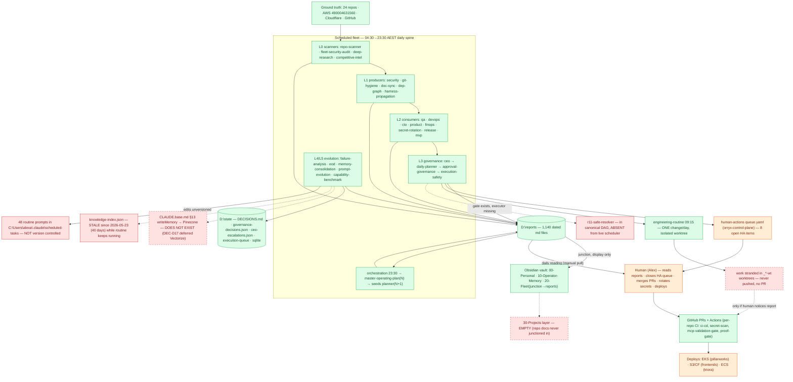

# 01 — Current-State System Map

As-built on 2026-07-02. Sources: live scheduler (30 fleet routines), `routines/routine-schedule.json`
(36 canonical), `D:\state`, `D:\reports` (1,140 files), `D:\Vault\main`, 24 repos.

## What the map says

**The observation half of the loop is excellent; the action half is throttled to near-zero.**
33 routines produce intelligence daily with a real dependency DAG, freshness gates
(PRODUCER_PRECHECK), circuit breakers, and an observability beacon (fleet-health). That is
genuinely ahead of most internal agent platforms. But everything converges on one human:
reports → HA queue → Alex → manual PR/merge/deploy/rotation. The fleet is ~90% sensing,
~10% acting.

### Missing links (red)
1. **r11-safe-resolver is not in the live scheduler.** The whole L3 governance spine
   (approval-governance posts `execution-queue/pending/*.json`, execution-safety gates it)
   terminates in an executor that never fires. The safelist pipeline is a bridge to nowhere.
2. **knowledge-index.json stale 40 days** while knowledge-ingestion-routine runs weekly —
   the routine writes its report but no longer maintains its index. Silent semantic failure
   (exactly the class fleet-health was built to catch, but it checks report *existence*, not
   index writeback).
3. **Prompts unversioned.** prompt-evolution-routine mutates 48 SKILL.md files with no git
   history, no diff review, no rollback. The fleet's actual behaviour is config that can drift
   invisibly.

### Dead ends (dashed red)
4. **Pinecone memory (CLAUDE.base.md §13).** Every `writeMemory` the harness mandates goes
   nowhere — DEC-D17 deferred the vector store. The harness commands agents to write to
   infrastructure that doesn't exist.
5. **engineering-routine worktrees.** Its one-change-per-day lands in an isolated worktree,
   never pushed, never PR'd. 11 `_*-wt` directories at D:\ root are stranded work products.
6. **Vault 30-Projects layer empty** — repo docs were meant to junction in; never wired.

### Duplicate paths / unnecessary complexity
7. **Five decision surfaces:** `DECISIONS.md`, `governance-decisions.json`,
   `ceo-escalations.json`, `queue.yaml`, vault DEC-* notes. Multi-writer trap already bitten
   (queue.yaml). One should be canonical (governance-decisions.json), the rest generated.
8. **Schedule drift:** live scheduler ≠ routine-schedule.json (see 03-fleet-dag.md drift
   table). Phase F re-timing pending; qa/devops/cto currently fire *before* their canonical
   slots, increasing SKIP/stale-input risk.

### Manual choke points (orange) — detailed in 06-human-intervention-heatmap.md
Report consumption, HA queue closure, all PR review/merge, all deploys, all secret rotations,
release tagging, pricing, vault schema ratification.

---
**Explanation:** above. **Implementation:** gaps 1–6 are the roadmap's quick wins (10-roadmap.md).
**Evolution:** regenerate when routine-schedule.json or the executor model changes.
**Obsidian:** `30-Projects/orryx-standards-architecture/01-system-map-current.md` (junction).
**GitHub:** `orryx-standards/architecture/01-system-map-current.md`.
**Auto-update:** documentation-sync flags drift when named paths/routines disappear; hand-edit on architecture change.
