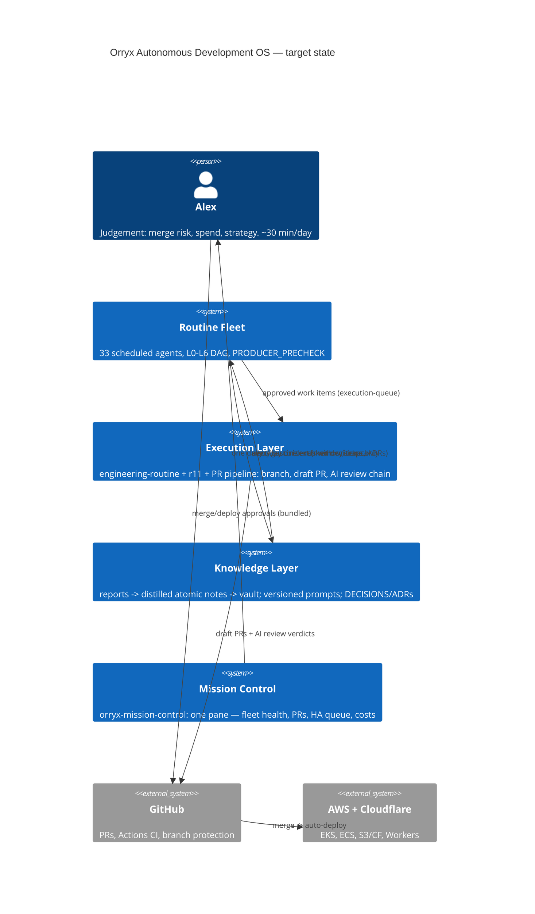
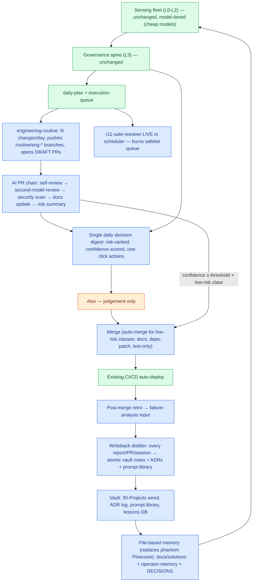

# 02 — Target-State Architecture

The same fleet, with the action half unthrottled and every loop closed. Design principle:
**human judgement only, never human administration** — the human touches decisions, not
mechanics.

## C4 context

## Target flow

## The five structural changes vs current state

1. **Executor unthrottling** — engineering-routine pushes branches and opens *draft* PRs
   (reversible, reviewable; strictly safer than today's stranded worktrees because work
   becomes visible and CI-tested). r11 restored to the scheduler. Merge stays human until
   confidence data justifies auto-merge classes (07-pr-lifecycle.md).
2. **AI PR chain** — nothing reaches the human without self-review, second-model review,
   security scan, and a risk-ranked summary. Human reads verdicts, not diffs (unless RED).
3. **One decision surface** — governance-decisions.json canonical; DECISIONS.md, vault ADRs,
   dashboard views all *generated* from it + ceo-escalations. queue.yaml becomes single-writer
   (approval-governance owns it; humans resolve via dashboard, not hand-edits).
4. **Writeback everywhere** — a routine's run isn't DONE until its knowledge writeback exists
   (04-knowledge-flow.md contract). Phantom Pinecone section deleted from CLAUDE.base.md,
   replaced with the file-based contract that already half-exists.
5. **Model tiering** — L0/L1 mechanical scans on cheap models, L2 on mid, L3/L4 synthesis on
   frontier. (03-fleet-dag.md audit table has per-routine assignments.)

---
**Explanation:** above. **Implementation:** sequenced in 10-roadmap.md (changes 1–2 are weeks 1–4).
**Evolution:** revisit when auto-merge classes go live and when Vectorize (DEC-D17) is un-deferred.
**Obsidian:** `30-Projects/orryx-standards-architecture/02-system-map-future.md`.
**GitHub:** `orryx-standards/architecture/02-system-map-future.md`.
**Auto-update:** hand-maintained; capability-benchmarking-routine reviews it fortnightly against reality and proposes diffs.
