# 03 — Automation Dependency Graph (Routine Fleet DAG)

Source of truth: [`routines/routine-schedule.json`](../routines/routine-schedule.json).
The diagram between the markers is **generated** by `scripts/generate-fleet-dag.ps1` — never
hand-edit it; edit the JSON and regenerate.

```mermaid
flowchart TD
  subgraph L0["L0 — root producers — scan ground truth directly, never consume sibling reports"]
    fleet_security_audit["fleet-security-audit<br/>monthly · 0 3 1 * *"]
    repo_scanner["repo-scanner<br/>daily · 30 4 * * *"]
    competitive_intelligence_routine["competitive-intelligence-routine<br/>weekly · 0 8 * * 6"]
    deep_research_routine["deep-research-routine<br/>weekly · 0 7 * * 0"]
  end
  subgraph L1["L1 — synthesis producers — consume L0, emit domain intelligence"]
    dependency_graph_builder["dependency-graph-builder<br/>weekly · 0 5 * * 1"]
    documentation_sync["documentation-sync<br/>condition · 0 5 * * *"]
    security_routine["security-routine<br/>daily · 20 5 * * *"]
    git_hygiene_routine["git-hygiene-routine<br/>daily · 30 5 * * *"]
    harness_propagation_routine["harness-propagation-routine<br/>condition · 45 5 * * *"]
  end
  subgraph L2["L2 — specialised consumers — single-domain synthesis over L1"]
    qa_routine["qa-routine<br/>daily · 0 6 * * *"]
    devops_routine["devops-routine<br/>daily · 12 6 * * *"]
    cto_routine["cto-routine<br/>daily · 35 6 * * *"]
    product_routine["product-routine<br/>weekly · 50 6 * * 1"]
    commercialstrategy_routine["commercialstrategy-routine<br/>weekly · 0 7 * * 3"]
    release_changelog_routine["release-changelog-routine<br/>condition · 20 7 * * *"]
    secret_rotation_tracker["secret-rotation-tracker<br/>daily · 30 7 * * *"]
    finops_routine["finops-routine<br/>weekly · 0 7 * * 5"]
    mvp_delivery_routine["mvp-delivery-routine<br/>weekly · 30 6 * * 1"]
  end
  subgraph L3["L3 — governance synthesizers — consume the full L2 cohort"]
    ceo_routine["ceo-routine<br/>daily · 15 8 * * *"]
    daily_planner_routine["daily-planner-routine<br/>daily · 30 8 * * *"]
    approval_governance_routine["approval-governance-routine<br/>daily · 45 8 * * *"]
    execution_safety_routine["execution-safety-routine<br/>daily · 0 9 * * *"]
    orchestration_routine["orchestration-routine<br/>daily · 30 23 * * *"]
  end
  subgraph L4["L4 — meta/evolution — weekly/fortnightly improvement loops"]
    failure_analysis_routine["failure-analysis-routine<br/>daily · 0 18 * * *"]
    autonomous_improvement_routine["autonomous-improvement-routine<br/>fortnightly · 0 9 * * 0"]
    frontier_architecture_routine["frontier-architecture-routine<br/>fortnightly · 0 10 * * 0"]
    prompt_evolution_routine["prompt-evolution-routine<br/>weekly · 0 11 * * 0"]
    capability_benchmarking_routine["capability-benchmarking-routine<br/>fortnightly · 0 21 * * 1"]
    tooling__mcp_discovery_routine["tooling--mcp-discovery-routine<br/>weekly · 0 21 * * 2"]
  end
  subgraph L5["L5 — state/continuity — eod, memory, knowledge"]
    end_of_day_distillation_routine["end-of-day-distillation-routine<br/>daily · 30 18 * * *"]
    memory_consolidation_routine["memory-consolidation-routine<br/>daily · 0 19 * * *"]
    knowledge_ingestion_routine["knowledge-ingestion-routine<br/>weekly · 0 8 * * 0"]
    innovation_backlog_routine["innovation-backlog-routine<br/>fortnightly · 0 8 * * 1"]
    fleet_health_routine["fleet-health-routine<br/>daily · 45 9 * * *"]
  end
  subgraph L6["L6 — executors/propagators — act on decisions (gated)"]
    engineering_routine["engineering-routine<br/>daily · 15 9 * * *"]
    r11_safe_resolver["r11-safe-resolver<br/>daily · 30 9 * * *"]
  end
  repo_scanner --> dependency_graph_builder
  repo_scanner --> documentation_sync
  repo_scanner --> security_routine
  repo_scanner --> git_hygiene_routine
  security_routine --> qa_routine
  dependency_graph_builder --> qa_routine
  documentation_sync --> qa_routine
  security_routine --> devops_routine
  repo_scanner --> devops_routine
  security_routine --> cto_routine
  qa_routine --> cto_routine
  devops_routine --> cto_routine
  dependency_graph_builder --> cto_routine
  cto_routine --> product_routine
  qa_routine --> product_routine
  security_routine --> product_routine
  product_routine --> commercialstrategy_routine
  cto_routine --> commercialstrategy_routine
  devops_routine --> release_changelog_routine
  security_routine --> secret_rotation_tracker
  devops_routine --> finops_routine
  repo_scanner --> finops_routine
  product_routine --> mvp_delivery_routine
  cto_routine --> ceo_routine
  security_routine --> ceo_routine
  devops_routine --> ceo_routine
  qa_routine --> ceo_routine
  ceo_routine --> daily_planner_routine
  ceo_routine --> approval_governance_routine
  daily_planner_routine --> approval_governance_routine
  ceo_routine --> execution_safety_routine
  approval_governance_routine --> execution_safety_routine
  security_routine --> execution_safety_routine
  execution_safety_routine --> engineering_routine
  daily_planner_routine --> engineering_routine
  execution_safety_routine --> r11_safe_resolver
  approval_governance_routine --> r11_safe_resolver
  ceo_routine --> end_of_day_distillation_routine
  failure_analysis_routine --> memory_consolidation_routine
  end_of_day_distillation_routine --> memory_consolidation_routine
  ceo_routine --> orchestration_routine
  execution_safety_routine --> orchestration_routine
  end_of_day_distillation_routine --> orchestration_routine
  memory_consolidation_routine --> orchestration_routine
  capability_benchmarking_routine --> autonomous_improvement_routine
  deep_research_routine --> frontier_architecture_routine
  frontier_architecture_routine --> prompt_evolution_routine
  autonomous_improvement_routine --> prompt_evolution_routine
  failure_analysis_routine --> prompt_evolution_routine
  competitive_intelligence_routine --> innovation_backlog_routine
  deep_research_routine --> innovation_backlog_routine
  frontier_architecture_routine --> innovation_backlog_routine
  failure_analysis_routine --> innovation_backlog_routine
  frontier_architecture_routine --> tooling__mcp_discovery_routine
```

<!-- GENERATED:fleet-dag:start -->

<!-- GENERATED:fleet-dag:end -->

## Live-scheduler vs canonical drift (audited 2026-07-02)

The scheduler was supposed to be aligned to the JSON ("the live scheduler is ALIGNED to this
file, not the reverse"). It isn't yet — Phase F re-timing is still pending:

| Routine | Canonical | Live | Impact |
|---|---|---|---|
| qa-routine | 06:00 | 05:46 | fires before security-routine reliably finishes → SKIP/stale risk |
| devops-routine | 06:12 | 05:51 | same |
| cto-routine | 06:35 | 06:18 | same, compounded (needs qa + devops) |
| fleet-security-audit | 03:00 d1 | 08:00 d1 | collides with morning governance window |
| autonomous-improvement | fortnightly | weekly | 2× intended cost |
| frontier-architecture | fortnightly | weekly | 2× intended cost |
| capability-benchmarking | fortnightly | weekly | 2× intended cost |
| innovation-backlog | fortnightly | weekly | 2× intended cost |
| **r11-safe-resolver** | daily 09:30 | **ABSENT** | execution-queue never drains — the DAG's only autonomous executor is missing |
| vault-competitive-intel-refresh | not in JSON | quarterly | unregistered → invisible to fleet-health expectations |
| pillarworks-m3-qs-benchmark-tracker | not in JSON | weekly | unregistered → invisible to fleet-health expectations |

**Fix (quick win):** apply Phase F re-timing (backup scheduler state first — known clobber
trap), register r11 + the two unregistered routines in the JSON, restore fortnightly cadences.

## Per-routine audit (condensed)

Columns: **T**rigger (cron unless noted) · **In/Out** per JSON · **Fail** dominant failure mode ·
**WB** knowledge writeback today · **HA** human approval · **$** proposed model tier
(C=cheap/Haiku, M=mid/Sonnet, F=frontier/Opus-Fable).

| Routine | Layer | Fail mode | WB today | HA | $ | Improvement |
|---|---|---|---|---|---|---|
| repo-scanner | L0 | silent partial scan | report only | — | C | mechanical; cheapest model, structured JSON out |
| fleet-security-audit | L0 | gh/gitleaks auth drift | report + FSA handoff | — | C | |
| deep-research / competitive-intel | L0 | web variance | report | — | M | |
| security-routine | L1 | branch-audit trap (audit main) | report + NEW/ESC ids | rotation=human | M | feeds secret-rotation ledger — keep |
| git-hygiene / doc-sync / harness-prop | L1 | NO_CHANGE misfire | report | — | C | doc-sync should also run diagram regen + prompt snapshot |
| dependency-graph-builder | L1 | gitlink≠worktree trap | dependency-graph.json | — | C | JSON is the substrate for this diagram — good |
| qa / devops / cto | L2 | stale-input consumption | report | — | M | fix drift (above) |
| product / commercial / finops / mvp / release / secret-rotation | L2 | pricing disk-verify trap | report + ledgers | pricing, release=human | M | |
| ceo-routine | L3 | stale re-emission (freshness-gated) | ceo-escalations.json | escalations=human | F | the one place frontier synthesis pays |
| daily-planner / approval-governance / execution-safety | L3 | spine-gap race (solved by temporal split) | plan + execution-queue | approve=human | M | approval-governance should emit *bundled* one-click decisions |
| orchestration | L3 | missed night → planner cadence gap | master-operating-plan | — | F | |
| engineering-routine | L6 | stranded worktrees (dead end) | report only | push/PR=human | F | **let it push branches + open draft PRs** |
| r11-safe-resolver | L6 | NOT SCHEDULED | report | gated by safety | M | restore to scheduler |
| failure-analysis / eod / memory-consolidation | L4/L5 | untrack≠scrub, multi-writer | DECISIONS.md append | — | M/F | |
| knowledge-ingestion | L5 | **index writeback broken (stale 40d)** | report only | — | M | fix or fold into memory-consolidation |
| prompt-evolution | L4 | edits unversioned prompts | report | should be PR-gated | F | edit the *versioned snapshot* via PR, propagate on merge |
| autonomous-improvement / frontier / capability / innovation / tooling | L4 | weekly-vs-fortnightly drift | reports | adopt=human | M | |
| fleet-health | L5 | expectations file drift | report | — | C | add *writeback* checks, not just report-existence |

---
**Explanation:** the DAG is correct-by-precheck, not by clock; drift table shows where the live
clock contradicts the declared order. **Implementation:** drift fixes = roadmap week 1.
**Evolution:** when executors multiply, split L6 into its own doc. **Obsidian:**
`30-Projects/orryx-standards-architecture/03-fleet-dag.md`. **GitHub:** `orryx-standards/architecture/03-fleet-dag.md`.
**Auto-update:** `scripts/generate-fleet-dag.ps1`, invoked by documentation-sync when routine-schedule.json changes.
