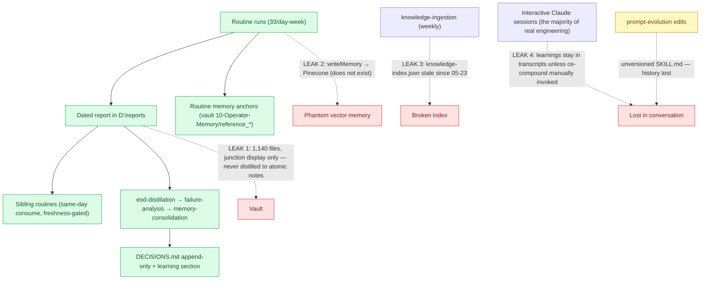
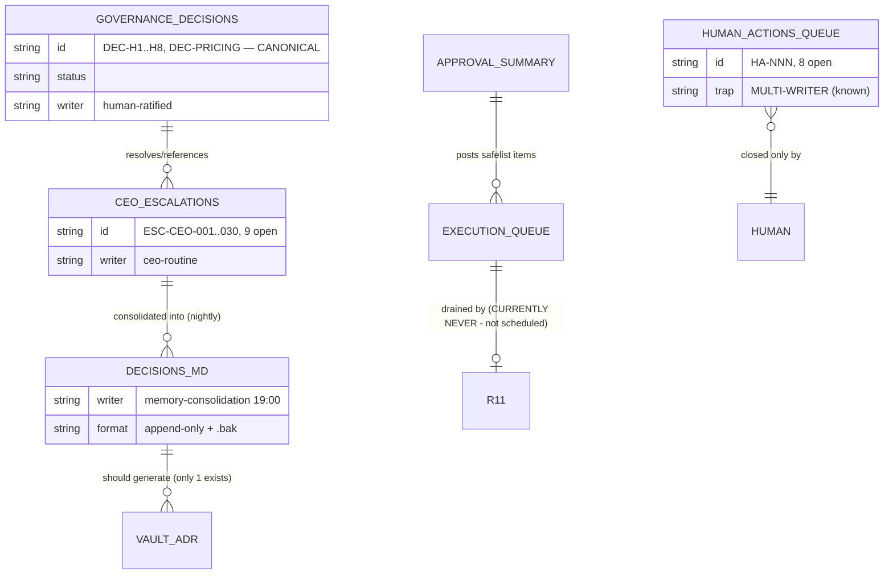

# 04 — Knowledge Flow & Writeback Framework

Nothing valuable should terminate inside a conversation, a report nobody re-reads, or a
worktree nobody merges. Audit of every path knowledge takes today, and the target contract.

## Current flow — with the four leaks marked

## State-file entity model (what exists, who writes it)

**Duplicate-surface ruling:** `governance-decisions.json` stays canonical for *decisions*;
`ceo-escalations.json` canonical for *escalations*; `queue.yaml` canonical for *human actions*
with **approval-governance as sole writer**; `DECISIONS.md` and vault ADR notes become
*generated views*. Anything else is a bug.

## The writeback contract (target)

A unit of work — routine run, PR, interactive session — is not DONE until:

| Question | Written to |
|---|---|
| What was decided + rationale? | governance-decisions.json → generated ADR note in vault `40-ADRs/` |
| What durable trap/lesson was learned? | routine anchor (`reference_*`) or repo `docs/solutions/` (ce-compound) |
| What changed in project state? | repo STATUS.md + vault `30-Projects/` junction (auto-visible) |
| What future work was created? | innovation-backlog / HA queue / execution-queue (one of, never zero) |
| What prompt improved? | **versioned** `routines/prompts/` via PR (never direct SKILL.md edit) |

Enforcement is cheap: **fleet-health already validates report existence — extend it to
validate writeback existence** (e.g. memory-consolidation ran but DECISIONS.md mtime didn't
change = semantic failure; knowledge-ingestion ran but index untouched = the exact bug live
today, undetected for 40 days).

## Fix list

1. **Delete CLAUDE.base.md §13 (Pinecone)** — replace with the file-based contract above.
   A harness that mandates writes to nonexistent infra trains agents to ignore the harness.
2. **Repair or fold knowledge-ingestion** — if the index adds nothing over memory-consolidation
   + MEMORY.md, retire it (YAGNI); if it stays, fleet-health checks its index mtime.
3. **Session-end writeback hook** — the ce-compound skill exists; make it a Stop-hook nudge in
   interactive sessions ("durable learning this session? → docs/solutions") instead of relying
   on memory.
4. **Distillation, not mirroring** — don't copy 1,140 reports into the vault. The nightly
   memory-consolidation already distils; point it at generating vault ADR/lesson notes from
   its Section-0 delta (one small prompt change).

---
**Explanation/Implementation:** above. **Evolution:** revisit when Vectorize (DEC-D17) lands —
the file layer stays the source, vectors become an index over it. **Obsidian:**
`30-Projects/orryx-standards-architecture/04-knowledge-flow.md`. **GitHub:** `orryx-standards/architecture/04-knowledge-flow.md`.
**Auto-update:** fleet-health writeback checks make drift self-announcing; doc hand-edited.
