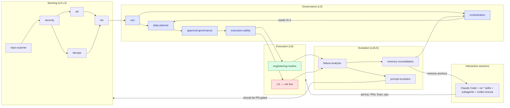

# 05 — Agent Interaction Map & Contracts

Two agent populations exist: the **scheduled fleet** (33 routines, contracts in
`routines/routine-schedule.json` + per-routine SKILL.md) and **interactive-session agents**
(Claude Code subagents: Explore/Plan/general-purpose, ce-* skills, codex rescue).

## Interaction map

## Per-agent contract table

Legend: **Esc** = escalation path · **FB** = fallback · **Retry** = retry behaviour ·
**Conf** = confidence threshold in effect · **RT** = expected runtime.

| Agent | Responsibility | Inputs | Outputs | Memory | Conf | Esc | FB | Retry | Writeback | RT |
|---|---|---|---|---|---|---|---|---|---|---|
| repo-scanner | ground-truth repo scan | git/fs | portfolio-summary | anchor note | n/a | report anomaly | none (root) | next-day | report | ~10m |
| security-routine | posture + secret findings | portfolio-summary | security-review, NEW/ESC ids | anchor (trap-rich) | n/a | ESC → ceo | skip (precheck) | next-day | report+ids | ~15m |
| qa/devops/cto | domain synthesis | L1 reports | domain summaries | anchors | n/a | ESC → ceo | SKIP on stale input | next-day | report | ~10-20m |
| ceo-routine | portfolio synthesis + escalation ledger | L2 cohort | ceo-summary, ceo-escalations.json | anchor + ledger | freshness gate 2/7 | HA queue | quiet-day mode | next-day | ledger | ~15m |
| approval-governance | consolidate approvals, post safelist | ceo, plan | approval-summary, execution-queue | anchor | n/a | HA queue | quiet-day | next-day | queue items | ~10m |
| execution-safety | HALT/GO verdict | security, approvals | safety verdict | H-1..H-5 conds | hard gate | HALT → human | HALT (fail-closed) | next-day | verdict | ~5m |
| engineering-routine | 1 substantive change | plan, safety | worktree change + ENG handoff | anchor | quality gates §5 | [REQUIRES HUMAN REVIEW] tags | NO_CHANGE skip | Ralph ≤5 iter, no-progress detector | **report only — gap: no branch/PR** | ~30-60m |
| r11-safe-resolver | drain safelist queue | execution-queue, safety | resolved items | dry-run gate R11_DRY_RUN | safelist-only | HALT/skip | skip | per-item | report | ~15m |
| failure-analysis | RCA over failures | eod(N-1) | FA report, tripwires | 4 trap classes | n/a | tripwire → capability-benchmark | none | next-day | tripwires | ~15m |
| memory-consolidation | durable state | FA, eod | DECISIONS.md + vault anchors | idempotent UPSERT | n/a | — | .bak restore | next-day | **the** writeback | ~10m |
| prompt-evolution | improve fleet prompts | evolution chain | prompt edits (29 tracked) | tier map | advisory charter | human ratify | none | weekly | **unversioned — gap** | ~20m |
| fleet-health | expected-vs-actual beacon | exit log, expectations | fleet-health report | breaker state | n/a | breaker trip → human | none | next-day | report | ~5m |
| Interactive session | everything ad-hoc | human intent | PRs, fixes, ops | MEMORY.md + CLAUDE.md | self-check ≥0.85 (§3) | ask human | codex:rescue (second opinion) | Ralph ≤3-5 | **only if ce-compound invoked — gap** | varies |

## Missing agent roles — ruling

Requested roster review (supervisor/planner/worker/critic/etc.): **most already exist under
other names.** Supervisor = orchestration; planner = daily-planner; workers = engineering/r11;
critic = failure-analysis; memory = memory-consolidation; research = deep-research; security =
security-routine; governance/risk = approval-governance + execution-safety; docs =
documentation-sync. Adding more roles now = coordination overhead without new capability.

Only two genuinely missing:
1. **PR-review agent chain** (self-review + second-model + risk summariser) — does not exist
   in any form; it's the gate that unlocks executor throughput (07-pr-lifecycle.md).
2. **Writeback distiller** — fold into memory-consolidation (04), not a new agent.

Explicitly rejected: separate "deployment agent" (CI/CD already deploys on merge; the gap is
merge, not deploy) and "orchestration agent v2" (temporal-split ADR already solved the race).

---
**Explanation/Implementation:** above; contracts live in SKILL.md files (to be versioned in
`routines/prompts/`). **Evolution:** re-table when PR chain lands. **Obsidian:**
`30-Projects/orryx-standards-architecture/05-agent-interactions.md`. **GitHub:** `orryx-standards/architecture/05-agent-interactions.md`.
**Auto-update:** contract columns sourced from SKILL.md frontmatter once prompts are versioned — documentation-sync diffs them.
