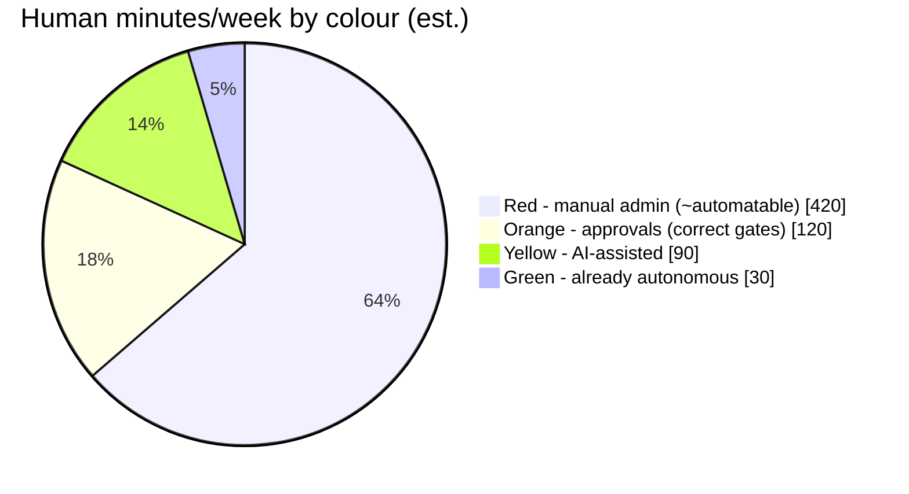

# 06 — Human Intervention Heatmap

Every place Alex currently spends time, colour-coded. Objective: **judgement only, never
administration.** 🟢 autonomous · 🟡 AI-assisted · 🟠 human approval (judgement — correct) ·
🔴 manual administration (wrong — automate).

| # | Touchpoint | Today | Target | How |
|---|---|---|---|---|
| 1 | Reading ~10 daily reports to find what matters | 🔴 | 🟢 | Single risk-ranked daily digest (approval-governance already synthesises — make its output THE morning artefact; dashboard 09) |
| 2 | HA queue closure (8 open; DEC-H3 un-started 42d) | 🔴 | 🟠 | Bundle related items (started 2026-07-02 session), attach one-click prepared actions, rank by unblocks_count × age |
| 3 | PR review — reading raw diffs | 🔴 | 🟡 | AI PR chain first-pass (07): human reads verdict + risk summary, diff only on RED |
| 4 | PR merge click | 🟠 | 🟠→🟢 | Stays human until confidence data exists; then auto-merge for docs/test-only/deps-patch classes |
| 5 | Landing engineering-routine worktree output | 🔴 | 🟢 | Routine pushes branch + opens draft PR itself (reversible) |
| 6 | Secret rotation execution (NEW-22 ~4mo, 9 passes) | 🔴 | 🟡 | Rotation is rightly human-gated, but prep isn't: agent stages runbook + exact commands + verification script; human runs one command. secret-rotation-tracker already ages — add "prepared" state |
| 7 | Deploy approvals (CT freeze ~101d, rollback ~137d) | 🟠 | 🟠 | Correct gate (PHI). Reduce cost: release-changelog's READY verdict + one-click deploy runbook |
| 8 | Release tagging/versioning | 🔴 | 🟡 | release-changelog drafts everything already; add "approve → agent tags+publishes" path |
| 9 | Pricing/commercial decisions (DEC-PRICING contradiction open) | 🟠 | 🟠 | Pure judgement — keep. AI supplies the decision memo |
| 10 | Vault schema ratification + ULID backfill | 🔴 | 🟢 | Backfill is mechanical — one agent session, human ratifies the diff |
| 11 | Phase F scheduler re-timing | 🟠 | 🟢 once | One-time apply with backup; then scheduler-vs-JSON drift check goes into fleet-health (🟢 forever) |
| 12 | Prompt-evolution ratification | 🔴 (implicit, unaudited) | 🟠 | Currently edits go live unversioned = silent. Versioned prompts + PR = real (cheap) approval gate |
| 13 | Root litter / stale worktree cleanup | 🔴 | 🟢 | git-hygiene already detects; give it a safelisted delete list (logs > 30d, merged worktrees) |
| 14 | Dependabot/deps PRs | 🟡 | 🟢 | Auto-merge patch-level on green CI (fleet already has gate taxonomy from 06-14/06-20 remediations) |
| 15 | Watching CI after merge | 🔴 | 🟢 | devops-routine reports next morning; for same-day, `/loop` babysitter or GH auto-notify — stop watching |

**The number that matters:** ~7 hrs/week of red. Items 1, 3, 5 alone are ~4 hrs/week and are
all unlocked by the same build (PR chain + digest). That's the roadmap's centre of gravity.

**Kept-human on purpose:** merge to prod repos, PHI/clinical anything, spend > safelist,
secret rotation execution, pricing, external publishing. These are judgement or blast-radius
gates — the goal is to make each cost 30 seconds, not to remove them.

---
**Explanation/Implementation:** above. **Evolution:** re-score fortnightly. **Obsidian:**
`30-Projects/orryx-standards-architecture/06-human-intervention-heatmap.md`. **GitHub:** `orryx-standards/architecture/06-human-intervention-heatmap.md`.
**Auto-update:** capability-benchmarking-routine re-scores this table fortnightly and proposes the diff.
