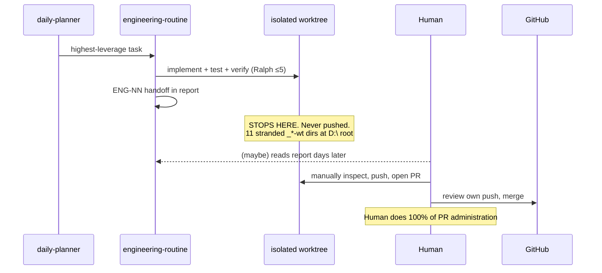
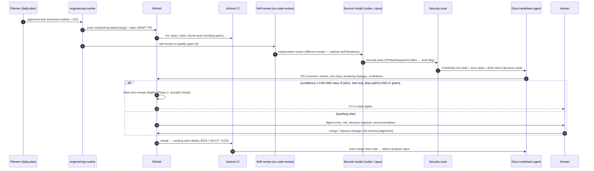
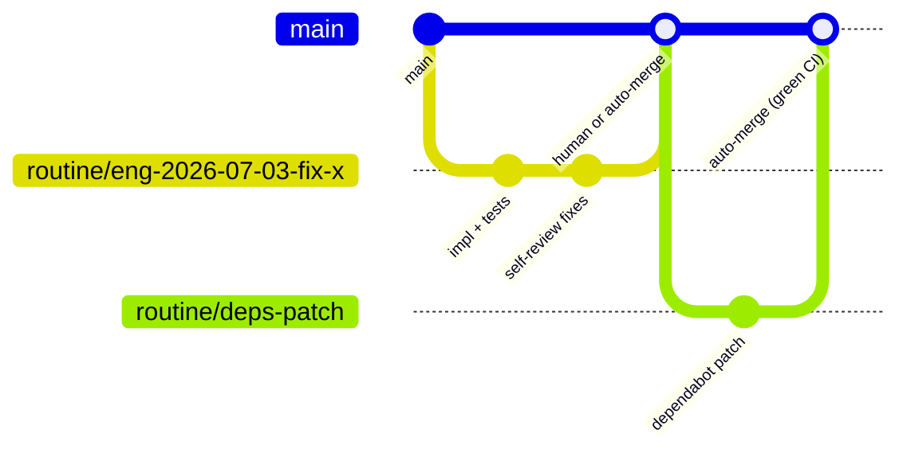
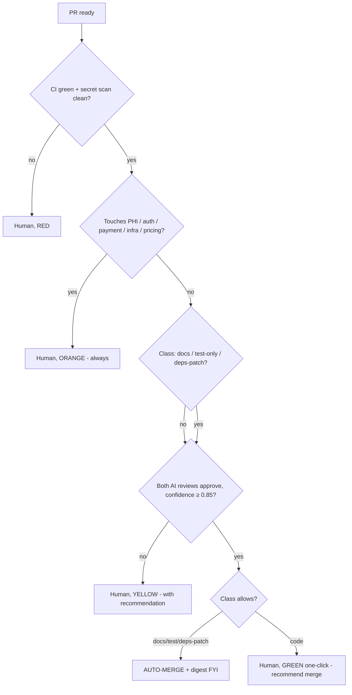
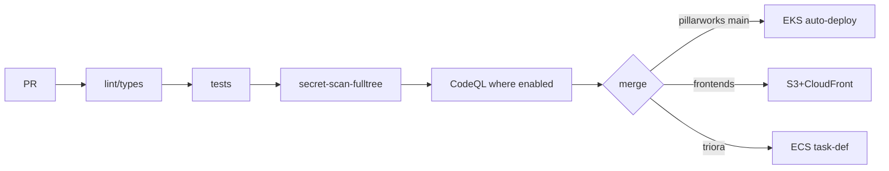

# 07 — PR Lifecycle: Current vs Target

## Current (the dead end)

## Target

## Branch model

`routine/*` namespace = agent-created, branch protection unchanged on `main`, worktrees
deleted after PR opens (kills the D:\ root litter class at the source).

## Auto-merge decision tree (Phase 2 — after ≥4 weeks of verdict data)

**Threshold policy:** start with auto-merge OFF; the chain only *labels*. After a month,
measure agreement rate between AI verdict and human decision per class; enable auto-merge for
any class ≥ 98% agreement. Confidence numbers are self-reported and gameable — **the gate is
the measured agreement rate, not the model's own confidence.**

## CI/CD gate inventory (existing, reused as-is)

Known trap carried forward: pre-deploy tests that run without db/redis (Triora #114 class —
unit-green ≠ gate-green). The PR chain's security/review stages must check *which* gates ran,
not just that they're green.

---
**Explanation/Implementation:** Phase 1 (draft PRs + chain, no auto-merge) = ~2 sessions of
work: extend engineering-routine SKILL.md (push+PR), one reusable `pr-review-chain` workflow
(ce-code-review mode:agent + codex rescue as second model). **Evolution:** Phase 2 auto-merge
per measured agreement. **Obsidian:** `30-Projects/orryx-standards-architecture/07-pr-lifecycle.md`.
**GitHub:** `orryx-standards/architecture/07-pr-lifecycle.md`. **Auto-update:** hand-edit;
agreement-rate table appended monthly by capability-benchmarking.
