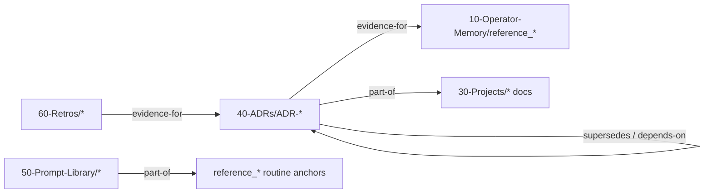

# 08 — Obsidian Vault: Target Structure

Current vault (D:\Vault\main) is healthy and fresh: 00-Personal (73 hand-written),
10-Operator-Memory (84 machine-written, live), 20-Fleet (junction → D:\reports),
30-Projects (empty). Keep the layer model — it's right. Fill the gaps, don't rebuild.

```mermaid
mindmap
  root((D:\Vault\main))
    00-Personal
      Concepts / Entities / Research / Strategy
      Decisions — personal DEC notes
      (unchanged; LEAK GUARD: never in a repo)
    10-Operator-Memory
      MEMORY.md MOC
      project_* (live state)
      reference_* (routine anchors = lessons DB)
    20-Fleet (junction → D:\reports)
      display-only, auto-rotating
    30-Projects — WIRE IT (junctions → repo docs)
      orryx-standards-architecture ✅ created 2026-07-02
      pillarworks-build-mvp/docs
      Clinical.Trials/docs
      orryx-brain/docs
    40-ADRs — NEW (generated)
      ADR-{id} from governance-decisions.json
      nightly by memory-consolidation
    50-Prompt-Library — NEW (junction → orryx-standards/routines/prompts)
      48 versioned SKILL.md files
      prompt-evolution PRs = change history
    60-Retros — NEW (generated)
      weekly retro from failure-analysis
      monthly strategic from ceo-summary roll-up
```

## Design rules

1. **Generated > hand-mirrored.** New layers 40/50/60 are junctions or routine-generated —
   zero manual upkeep. The vault's job is *navigability* (graph, backlinks, search), not
   storage; canonical data stays in repos/state files (graph-is-display-not-data lesson).
2. **ADR pipeline:** memory-consolidation already writes DECISIONS.md nightly. Add one step:
   for each new DEC-*/keystone, emit `40-ADRs/ADR-{id}.md` with frontmatter
   (`type: decision`, `status`, typed `related:`) linking the escalations it resolves and the
   project note it belongs to. That single change gives the decision log, backlinks, and graph
   in one move — the "1 ADR in vault" problem disappears without a new agent.
3. **MOC structure:** `Home.md` (exists) → layer MOCs. Only two new MOCs needed:
   `40-ADRs/_ADR-Index.md` (generated, one line per ADR) and `50-Prompt-Library/_Prompt-Index.md`
   (generated from snapshot script). MEMORY.md already serves 10-Operator-Memory.
4. **Schema migration:** finish the proposed uid/type/domain/status frontmatter as a single
   mechanical agent session over the 47 legacy notes; human ratifies the diff. Don't let a
   half-migrated schema sit — mixed frontmatter breaks the typed-links graph you built it for.
5. **Not doing (YAGNI):** meeting-notes layer (no meetings feed exists), bug database
   (failure-analysis reports + tripwires already are one, junctioned via 20-Fleet),
   research indexing beyond what deep-research reports + MEMORY.md give.

## Backlink relationships (typed `related:` vocabulary — already ratified in _SCHEMA.md)



---
**Explanation/Implementation:** 30-Projects junctions + 50 junction = 15 minutes; ADR pipeline
= one prompt change to memory-consolidation; schema backfill = one session. **Evolution:**
Vectorize index over vault when DEC-D17 un-defers. **Obsidian:** this doc itself at
`30-Projects/orryx-standards-architecture/08-vault-structure.md`. **GitHub:**
`orryx-standards/architecture/08-vault-structure.md`. **Auto-update:** generated layers
self-update; documentation-sync flags junction breakage.
