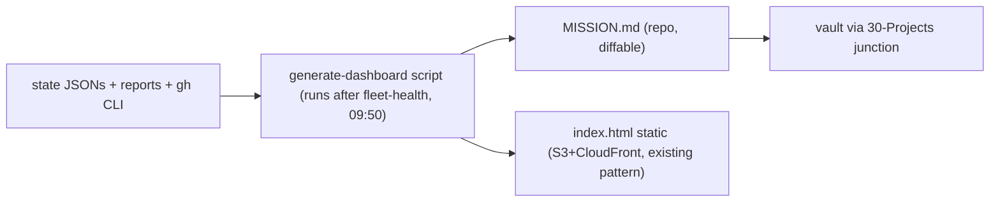

# 09 — Mission Control Dashboard Spec

**Home: `orryx-mission-control` (existing, in-scope repo — no new hosting; AWS/CF rule).**
Phase 1 is a *generated static page* — every data source below already exists as JSON/md on
disk; the dashboard is a renderer, not a system. No live backend until the static page proves
insufficient.

## Data sources (all existing)

| Panel | Source |
|---|---|
| Fleet health (ran/skipped/failed/dormant, stale-input, breaker trips, per-routine token cost) | `fleet-exit-log.jsonl` + `fleet-expectations.json` + fleet-health report |
| Pending human decisions | `queue.yaml` (HA items) + `ceo-escalations.json` (9 open) + approval-summary |
| Open PRs + AI verdicts | `gh pr list` across repos + PR-chain labels (once 07 lands) |
| Blocked work / execution queue | `D:\state\execution-queue\*` |
| Secret-rotation SLA ledger | secret-rotation-tracker output |
| Release readiness | release-changelog verdicts |
| Costs | finops-routine report + GH Actions budget report |
| Knowledge writeback status | fleet-health writeback checks (04) — DECISIONS.md mtime, ADR count, prompt-snapshot drift |
| Recent learnings | DECISIONS.md Section 0 delta + failure-analysis tripwires |
| Suggested next actions | daily-plan + master-operating-plan(N-1) |

## Layout

```
┌────────────────────────────────────────────────────────────────┐
│  DECIDE TODAY (risk-ranked, one-click)          ← the only     │
│  ● HA-006 rotate CF token   [prepared cmd]        panel that    │
│  ● PR#211 merge? AI: GREEN 0.91 [merge]           matters      │
├──────────────────┬──────────────────┬──────────────────────────┤
│ FLEET 31/33 ran  │ PRs 4 open       │ ROTATIONS 2 overdue      │
│ 1 stale-input    │ 2 auto-eligible  │ NEW-22: 104d 🔴          │
│ 1 dormant (r11)  │ 1 needs human    │                          │
├──────────────────┼──────────────────┼──────────────────────────┤
│ COSTS            │ WRITEBACK        │ LEARNINGS (7d)           │
│ tokens/routine   │ index ✅ ADR ✅   │ 3 new tripwires          │
│ AWS Δ, Actions Δ │ prompts Δ2 ⚠️    │ 1 new trap class         │
├──────────────────┴──────────────────┴──────────────────────────┤
│ RELEASE READINESS: pillarworks READY · CT blocked (rotation)    │
└────────────────────────────────────────────────────────────────┘
```

## Generation flow



**Deliberately skipped:** live websockets, auth, historical charting (the dated report files
ARE the history; add charts only when a real question needs them). The "DECIDE TODAY" panel
replaces heatmap item #1 (reading 10 reports) — that's the ROI, everything else is garnish.

---
**Explanation/Implementation:** one generator script + one routine slot after fleet-health;
build UI with ce-frontend-design-studio when it graduates to HTML. **Evolution:** add
agreement-rate and auto-merge stats when 07 Phase 2 starts. **Obsidian:** junctioned MISSION.md.
**GitHub:** `orryx-mission-control` (spec lives here: `orryx-standards/architecture/09-dashboard-spec.md`).
**Auto-update:** regenerated daily at 09:50 by the fleet-health slot.
