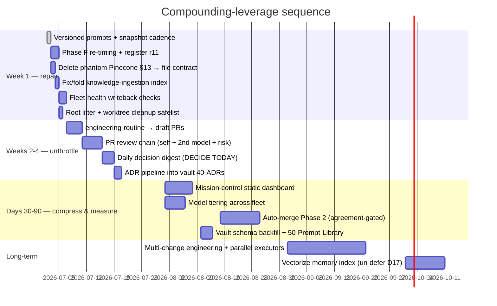

# 10 — Prioritised Roadmap

Sequencing principle: **fix the loops that are silently broken → unthrottle the executor →
compress human review → then compound.** Effort in agent-sessions (S) + human minutes (H).

## Quick wins (this week)

| # | Item | Why | Effort | ROI | Risk |
|---|---|---|---|---|---|
| 1 | **Version the 48 routine prompts** (`routines/prompts/` snapshot, daily via harness-propagation) | prompt-evolution mutates fleet behaviour with no history/rollback — unauditable drift | 0.5S (done in this branch) | Every future prompt bug becomes diffable; prerequisite for #12-heatmap gate | none |
| 2 | **Phase F re-timing + register r11 + 2 stray routines** | qa/devops/cto fire early (stale risk); 4 routines run 2× intended cadence (~cost); the DAG's only executor never fires | 1S + 15H | Restores DAG integrity; halves L4 spend; execution-queue finally drains | clobber trap — backup scheduler state first (known) |
| 3 | **Delete CLAUDE.base.md §13 Pinecone → file writeback contract** | Harness mandates writes to nonexistent infra; trains agents to ignore harness | 0.5S | Honest harness; unblocks 04 contract | none |
| 4 | **Fix or retire knowledge-ingestion index** | 40 days silently stale | 0.5S | Closes leak 3 | none |
| 5 | **Fleet-health writeback checks** (DECISIONS mtime, index mtime, ADR emission) | Catches the semantic-failure class that existence-checks miss — would have caught #4 six weeks ago | 1S | Permanent early-warning | none |
| 6 | **Cleanup safelist for git-hygiene** (bt-pr66 logs ~1GB, `nul`, stale worktrees post-PR) | 1GB litter + 11 stranded worktrees; recurring class | 0.5S | Hygiene forever, not once | deletes gated by safelist |

## 30–90 days

| # | Item | Why | Effort | ROI | Depends |
|---|---|---|---|---|---|
| 7 | **Draft-PR executor** (engineering-routine pushes `routine/*`, opens draft PRs) | Kills the worktree dead end; work becomes visible + CI-tested; strictly safer than stranding | 2S | Executor throughput 0→N/day visible units | #2 |
| 8 | **PR review chain** | Nothing reaches human without 2-model review + risk verdict; converts 30-min reviews to 3-min | 3S | ~3-4 H-hrs/week; the auto-merge dataset | #7 |
| 9 | **DECIDE TODAY digest** (approval-governance output becomes the one morning artefact + one-click prepared actions) | Heatmap #1 + #2: the single biggest red block | 2S | ~2 H-hrs/week; faster HA closure attacks the binding constraint (human-closure latency) | — |
| 10 | **ADR pipeline** (memory-consolidation emits vault 40-ADRs from DEC-*) | Decision log becomes navigable knowledge; 1→N ADRs at zero marginal cost | 0.5S | Compounding retrieval | — |
| 11 | **Model tiering** | L0/L1 mechanical scans don't need frontier models; est. 40-60% fleet token cut | 1S | $$ monthly, forever | verify per-task model support in scheduler |
| 12 | **Dashboard Phase 1** (static MISSION.md/html) | One pane replaces report-reading | 2S | consolidates #9 | #5 |
| 13 | **Auto-merge Phase 2** (agreement-rate-gated, low-risk classes only) | Removes the last admin click for docs/test/deps-patch | 1S | ~1 H-hr/week | ≥4 wks of #8 data |

## Long-term (the AI operating system)

- **Parallel executors:** once draft-PR flow is proven, lift the 1-change/day cap — N tasks/day
  in isolated worktrees → N draft PRs; planner ranks, chain reviews, human merges a bundle.
- **Recursive improvement with teeth:** prompt-evolution proposes PRs against
  `routines/prompts/`; capability-benchmarking measures each routine's verdict-agreement and
  cost; regression in either auto-reverts the prompt (git makes this trivial once #1 exists).
- **Memory v2:** un-defer DEC-D17 (Vectorize) as an *index over* the file layer, not a second
  store — retrieval for agents, vault stays the human view.
- **Profitability lens:** the fleet itself is Orryx's best demo. Package the pattern
  (schedule DAG + PRODUCER_PRECHECK + fleet-health + writeback contract) as the Orryx
  reference architecture — consulting collateral and the seed of the product. The
  architecture docs in this folder are literally reusable IP; the Brisbane-gynae/Cavalier
  class of client work gets the same digest+dashboard pattern at near-zero marginal cost.

## Explicitly not doing

- New agent roles beyond the PR chain (05 ruling — supervisors/critics already exist by other names).
- Live dashboard backend, meeting-notes layer, bug DB (existing artefacts already serve these).
- Auto-merge for anything touching PHI/auth/payment/infra/pricing — permanent human gates.

---
**Obsidian:** `30-Projects/orryx-standards-architecture/10-roadmap.md`. **GitHub:**
`orryx-standards/architecture/10-roadmap.md`. **Auto-update:** item status reviewed by
capability-benchmarking fortnightly; done items get struck with the evidence link.
